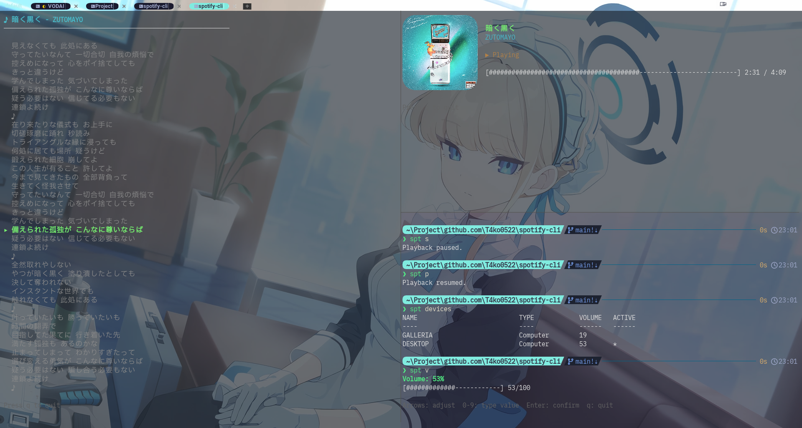

<h1 align="center">Spotify-CLI</h1>

<h3 align="center">Control Spotify from your terminal. TUI + CLI.</h3>

<p align="center">
  
</p>

<p align="center">
  <a href="https://github.com/T4ko0522/Spotify-CLI/releases"></a>
  <a href="https://github.com/T4ko0522/Spotify-CLI/blob/main/LICENSE"></a>
  
  
</p>

<p align="center">
  Now Playing TUI · Album Art · Synced Lyrics · Volume Control · Device Management
</p>

<p align="center">
  English | <a href="README.ja.md">日本語</a>
</p>

---

## ✨ Features

- **Now Playing TUI** — real-time track info with album art (WezTerm)
- **Synced Lyrics** — timestamped lyrics via [LRCLIB](https://lrclib.net)
- **Playback Control** — play, stop, next, back
- **Volume Control** — TUI slider or direct value
- **Device Management** — list and switch active devices
- **Image Presets** — small / medium / large album art

## 📋 Requirements

- Client ID from [Spotify Developer](https://developer.spotify.com/)
- Redirect URI: `http://127.0.0.1:8888/callback`

## 📦 Installation

### Windows

Download `spt.msi` from [Releases](https://github.com/T4ko0522/Spotify-CLI/releases) and run it.

### macOS / Linux

**From source** (requires Go 1.25+):

```bash
go install github.com/T4ko0522/spotify-cli@latest
```

**From binary**: Download from [Releases](https://github.com/T4ko0522/Spotify-CLI/releases) and place in your `$PATH`.

## 🚀 Quick Start

```bash
spt setup    # Configure Client ID & authenticate
spt          # Launch Now Playing TUI
spt -l       # Show synced lyrics
```

## 📖 Commands

| Command | Alias | Description |
|---|---|---|
| `spt` | | Launch TUI (Now Playing) |
| `spt --lyrics` | `spt -l` | Show synced lyrics |
| `spt setup` | | Configure Client ID & Spotify auth |
| `spt play` | `spt p` | Resume playback |
| `spt stop` | `spt s` | Pause |
| `spt next` | `spt n` | Next track |
| `spt back` | `spt b` | Previous track |
| `spt now` | | Show currently playing track |
| `spt volume` | `spt v` | Launch volume control TUI |
| `spt volume [0-100]` | `spt v [0-100]` | Set volume |
| `spt devices` | `spt d` | List available devices |
| `spt settings` | | Change image size preset |

## ⚙️ Settings

Use `spt settings` to change album art size. Arrow keys to select, Enter to confirm.

| Preset | Size |
|---|---|
| small | 16×8 |
| medium | 20×10 (default) |
| large | 28×14 |

## 📄 License

[Apache-2.0 LICENSE](https://github.com/T4ko0522/Spotify-CLI/blob/main/LICENSE)
